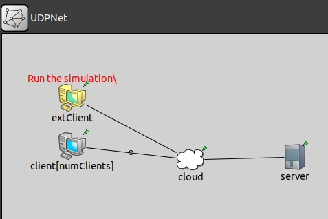

# ExtUDP-OMNET Simulation Project

This project provides an example of simulating UDP connections in OMNeT++ 4.6 without using the INET Framework. The purpose of this simulation is to model a UDP-based client-server architecture with an external Python script acting as a UDP client.



## Project Purpose

The primary goal of this project is to demonstrate how to simulate UDP connections using OMNeT++. This simulation includes a UDP server and clients within OMNeT++ and extends to an external UDP client implemented in Python.

## Requirements

- **OMNeT++ 4.6**: [Download OMNeT++ 4.6](https://omnetpp.org/omnetpp/doc_details/2295-omnet-4-6-source-tgz)

## Installation and Setup

### Step 1: Install OMNeT++

1. Download and install OMNeT++ 4.6 from the provided link.
2. Follow the installation instructions in the OMNeT++ documentation.

### Step 2: Clone the extUDP Project

Clone the project repository from GitHub:

```sh
git clone https://github.com/flaviol-souza/ExtUDP-OMNET
```

### Step 3: Build the Project

1. Open the OMNeT++ IDE.
2. Import the `ExtUDP-OMNET` project.
3. Build the project by right-clicking on the project and selecting `Build Project`.

## Configuration

Modify the `omnetpp.ini` file to match your network configuration:

```ini
[General]
scheduler-class = "cSocketRTScheduler"
network = UDPNet

cmdenv-express-mode = true
tkenv-default-run = 0

**.numClients = 1
**.cloud.propDelay = 0.1s
**.server.serviceTime = 0.1s
**.client[*].sendIaTime = exponential(3s)
```

## Running the Simulation

1. Start the OMNeT++ IDE.
2. Load and run the simulation by selecting the appropriate run configuration.
3. Observe the simulation using the graphical interface.

## External Client Script

The project includes a Python script to act as an external UDP client. To run the Python script:

```sh
python3 clientExt.py
```

This script will send a message to the UDP server simulated in OMNeT++ and print the received response.

## License

This project is licensed under the MIT License. See the [LICENSE](LICENSE) file for details.
